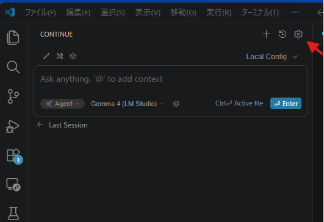
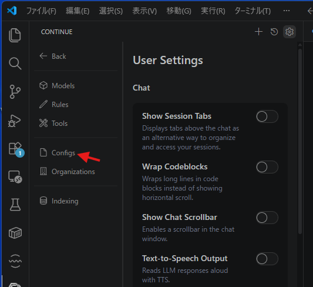
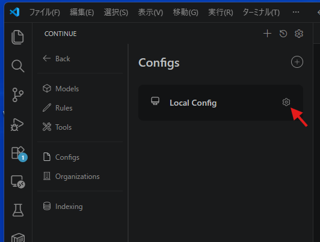
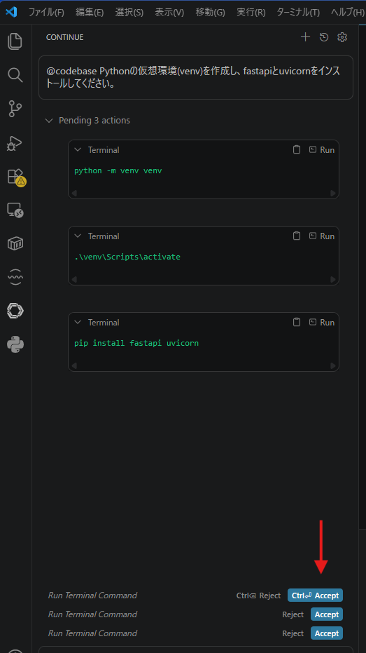
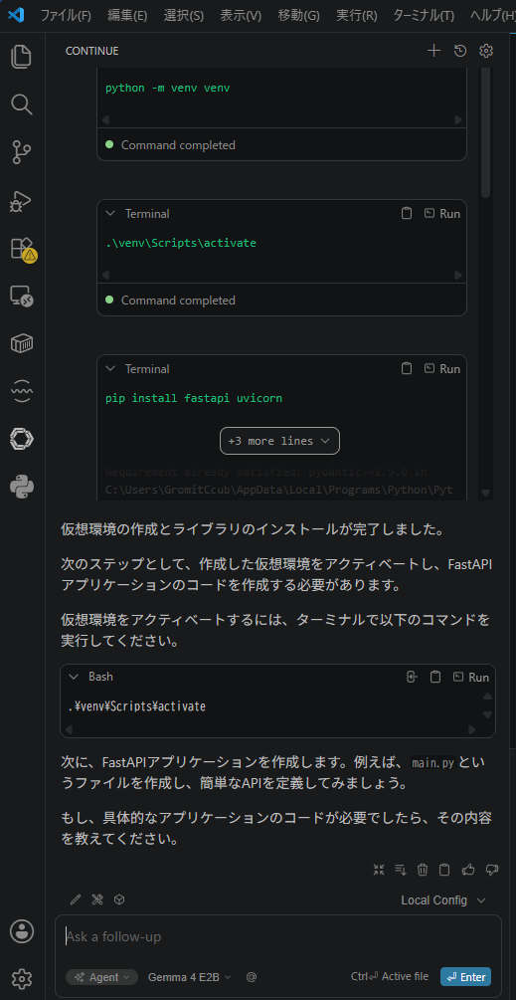
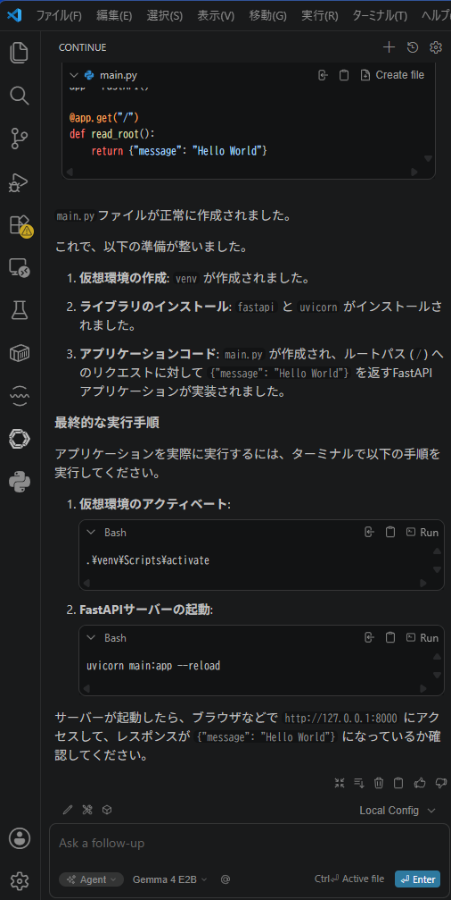
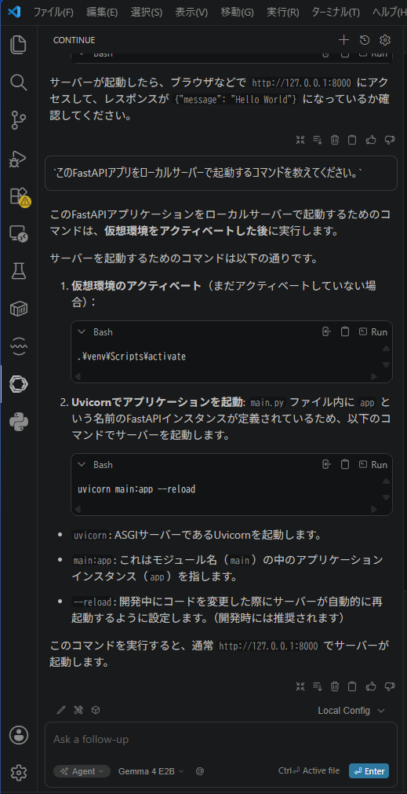

# 無料・無制限で試せるローカルLLM入門
AIを活用してコーディングの品質とスピードをアップしよう！

## 1. はじめに (WHY)
近年、AIによるコーディング支援が急速に普及し、開発のあり方が大きく変わりつつあります。<br>

- 「AIを使ってみたいけれど、利用料金が気になる」
- 「コードを外部のクラウドAIに送信するのはセキュリティ上の不安がある」

と感じている方も多いのではないでしょうか？

この記事では、そんなお悩みを解決する **「ローカルLLM」** の活用方法をご紹介します。<br>
自分のパソコン（ローカルPC）上でAIを動かすことで、<br>
**利用回数や月額料金を一切気にすることなく、何度でも試行錯誤しながらAIに指示を出す**<br>
ことができます。<br>
まずはコストゼロのローカル環境でAIとの対話に慣れ、コーディングの品質とスピード向上を実感してみましょう！

## 2. ローカルAI環境の作り方 (WHAT & HOW)

今回は、簡単にローカル環境を構築できるツール「 **Ollama** 」と、VS Code上でAIを使える拡張機能「**Continue**」を組み合わせてセットアップします。

> **💡 専門用語ミニ解説**
> * **LLM (大規模言語モデル):** ChatGPTなどに代表される、文章やコードを理解・生成するAIのベースとなる技術。
> * **ローカルLLM:** クラウドではなく、自分のPCのリソース（CPU/GPU）を使って直接実行するLLMのこと。オフラインでも動作し、情報漏洩のリスクがありません。

### ステップ1: Ollamaのインストールとモデルの準備

**Ollama（オラマ）** は、複雑な設定なしにローカルPCでLLMを動かせる非常に便利なツールです。

1. **インストール:**<br>
    [Ollamaの公式サイト(https://ollama.com/)](https://ollama.com/) にアクセスし、お使いのOS（Windows / macOS / Linux）向けのインストーラーをダウンロードして実行します。
2. **モデルのダウンロード:**<br>
   インストール完了後、ターミナル（またはコマンドプロンプト）を開き、コーディングに特化したAIモデルをダウンロードします。<br>
   今回は使いやすい `gemma4:e2b` を使用します。<br>
   コードに特化したい場合は `qwen2.5-coder:7b` を使ってみてください。

以下のコマンドをコピー＆ペーストして実行してください。

```bash
ollama run gemma4:e2b
```
*※初回実行時はモデルデータのダウンロードが行われるため、数分程度かかります。ダウンロードが終わると対話モードになりますが、今回はVS Codeから使うため `Ctrl + D` で終了して構いません。裏側でOllamaが待機状態になります。*

### ステップ2: VS Code拡張機能「Continue」の設定

次に、使い慣れたエディタ（VS Code）から先ほどのAIを呼び出せるようにします。

1. **インストール:** VS Codeの拡張機能ビューから **「Continue」** を検索し、インストールします。
2. **設定の変更:** Continueの設定ファイル（`config.json`）を開き、Ollamaを使用するように追記します。  
   画面左側のContinueアイコンをクリックし、歯車マークから設定ファイルを開きます。   
   <details>
     <summary>画像で設定方法を見る（ここをクリックすると画像が開きます）</summary>

      - 設定ボタン  
        
      - configメニューを開く  
        
      - config.yamlを開く  
        

   </details>

以下の設定例を参考に、`"models"` の部分を書き換えてください。

```yaml
name: Local Config
version: 1.0.0
schema: v1

models:
  - name: Gemma 4 E2B
    provider: ollama
    model: gemma4:e2b
    apiBase: http://127.0.0.1:11434
    contextLength: 16384
    roles:
      - chat
      - edit
      - apply
      - autocomplete
```

### ステップ3: チュートリアル！エージェント機能でFastAPI環境を自動構築してみよう

設定が完了したら、Continueの強力な「エージェント機能」を使って、Pythonの軽量Webフレームワーク「 **FastAPI** 」の環境構築から「Hello World」APIの実装までをAIに任せてみましょう！

単なるコードの生成だけでなく、ターミナルでのコマンド実行までAIがアシストしてくれます。VS Codeで空のフォルダを開き、Continueのチャットウィンドウから以下のステップを進めてください。

> [!TIP]
> * 先に動いた感じを画像で確認したい方はこちら
>   <details>
>   <summary>（ここをクリックすると画像が開きます）</summary>
>
>   - ① 環境の初期化（Scaffolding）  
>     
>   - なんとAPIの実装まで提案してくれましたが、一旦おいてチュートリアルの通り進めます。  
>     
>   - ② APIの実装  
>     
>   - ③ アプリの起動と動作確認   
>     
>
>   </details>

#### ⓪ はじめに

1. Python3 インストールする<br>
   [Python](https://www.python.org/) からご自分の環境用の Python3 をダウンロードしてインストールしてください。
2. 作業フォルダとを作成する<br>
   任意の場所にフォルダを作成してください。
3. README.md ファイルを作成する<br>
   VSCode起動して作業フォルダを開きます。<br>
   作業フォルダの直下に README.md ファイルを作成してください。中身はなんでもOKです。<br>
   *これによりAIが作業場所を間違えなくなります。

#### ① 環境の初期化（Scaffolding）

**「Continue」** のチャットを開いて下記のプロンプトを入力して、仮想環境の作成とライブラリのインストールを指示します。

> **プロンプト:**
> `@codebase Pythonの仮想環境(venv)を作成し、fastapiとuvicornをインストールしてください。`

AIがターミナルで実行すべきコマンド（`python -m venv venv` や `pip install` など）を提案してくれます。提示されたコマンドの「Run（実行）」ボタンをクリックして承認するだけで、面倒な環境構築が完了します。

#### ② APIの実装
環境が整ったら、次にAPIの中身を作ってもらいます。

> **プロンプト:**
> `main.py を作成し、ルートパス '/' にアクセスしたときに {"message": "Hello World"} を返す FastAPI アプリを実装してください。`

AIが即座にコードを生成し、ファイルの作成と書き込みを提案・実行してくれます。

#### ③ アプリの起動と動作確認
最後に、作成したアプリを起動します。起動コマンドが分からない場合もAIに聞けば大丈夫です。

> **プロンプト:**
> `このFastAPIアプリをローカルサーバーで起動するコマンドを教えてください。`

提案されたコマンド（例: `uvicorn main:app --reload`）を実行し、ブラウザで `http://127.0.0.1:8000` にアクセスしてみましょう。画面に `{"message": "Hello World"}` と表示されれば大成功です！

**💡 上手く使いこなすコツ**<br>
もし途中でエラーが出た場合は、そのエラーメッセージをコピーしてそのままAIに貼り付け、「このエラーの原因と修正方法を教えて」と聞いてみてください。<br>
ローカル環境なので、 **「何度間違えても無料で聞き放題」**です！

> [!TIP]
> * システムプロンプトを使って適当なロールを設定すると生成されるコード品質を上げることができますので試してみてください。  
>   - [システムプロンプトの基本構成要素](./SystemPrompt.md)
>   - [Python用で使ってるやつ](./PythonSample.md)
> * システムプロンプトは要望をざっと書いてあとは、AIにレビューさせながら作るのがおすすめです。
>   - 勝手に英訳してくれますし 🤗

## 3. まとめ (NEXT STEP)

この記事では、ローカルPC上で無料で使えるAIコーディング支援環境の構築から、実際のAPI開発を通したチュートリアルをご紹介しました。

* **Ollama** と **Continue** を使えば、15分程度でローカルAI環境が完成します。
* エージェント機能を活用すれば、環境構築やボイラープレート（定型コード）の作成にかかる時間を劇的に短縮できます。
* ローカルLLMなら、セキュリティを担保しつつ、**費用を気にせず何度でもAIと壁打ち**が可能です。

**🚀 次のステップ**
* **公式ドキュメントを読む:** [Continue 公式ドキュメント](https://docs.continue.dev/) には、さらに便利なショートカットや使い方が載っています。
* チュートリアルの続きとして、「このAPIにユーザー情報を返す新しいエンドポイントを追加して」など、さらに指示を重ねてアプリを拡張してみましょう！

社内でもAI活用のナレッジ共有を進めていきたいと考えています。試してみた感想や、役に立ったプロンプトがあれば、ぜひ社内チャットツール等でシェアしてくださいね！
