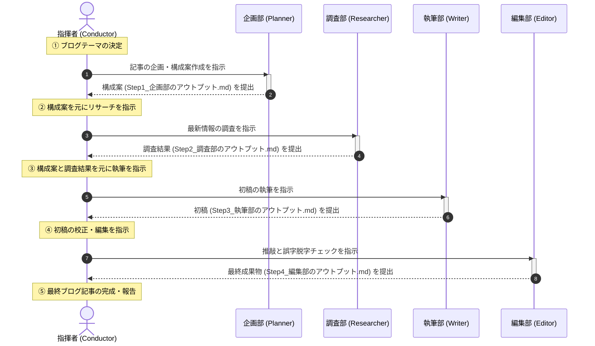

# AIをフォルダで組織化！マルチエージェントのノンコード設計ガイド

近年、ChatGPTやGeminiをはじめとする生成AIの進化により、様々な日常業務が自動化できるようになりました。

しかし、「1つの巨大な指示（プロンプト）」を使って複雑な仕事をAIに丸投げしようとすると、途中で指示を無視したり、嘘の情報を出力したり（ハルシネーション）、エラーが発生した際に最初からやり直す羽目になったりと、限界に突き当たることが多々あります。

この問題を根本から解決するのが、複数のAIに役割を分担させて協調動作させる **「マルチエージェント」** というアプローチです。

「マルチエージェントなんて、エンジニアがプログラムを書かないと作れないのでは？」と思うかもしれません。

しかし、実は誰もがPCで普段使っている **「フォルダとMarkdown（マークダウン）ファイル（ディレクトリ構造）」** を使って、会社組織を模倣するように設計するだけで、プログラミングなしでもその本質を理解し、構築することができます。

この記事では、AIを分割して動かすメリットと、ノンプログラマーでも今すぐ試せる「フォルダ構成による疑似組織モデル」のチュートリアルを分かりやすく解説します。

> 🚩 チュートリアルはスキップして動かしてみたい方は、下記にサンプルを作成してありますので、clone して動かしてみて下さい。  
> [Publisher Agent System (ブログ記事自動生成マルチエージェント)](https://github.com/murcubcc110/publisher)  
> Codex や Antigravity などの エージェントでフォルダを開いて、最初に「オンボーディングを開始して下さい」として下さい。  
> あとは、リポジトリの README.md の使い方で指示を出してみて下さい。

---

## 1. 複数のエージェントに分けるメリット (WHY)

AIを「1つの万能アシスタント」として使うシングルエージェントに対し、複数の専門的なAIの組み合わせとして使うマルチエージェントには、以下のような圧倒的なメリットがあります。

### メリット1：役割の専門化（Role-Specialization）による精度向上
1人の人間に「企画も、調査も、執筆も、校正もすべて完璧にやってくれ」と頼むとキャパシティオーバーになるのと同様に、AIも1つのチャットセッションで多くのタスクを同時にこなそうとすると、指示の優先順位が混乱し、品質が低下します。

「あなたは企画担当です」「あなたは編集担当です」と役割（エージェント）を分割し、個々のAIへの指示をシンプルに保つことで、回答の精度と安定性が劇的に向上します。

> **💡 用語解説：プロンプト**  
> AI（大規模言語モデル）に対して、どのような振る舞いや出力を求めるかを記述した指示文のことです。

### メリット2：コンテキストの最適化とコスト削減
AIは、入力される文章量ややり取りの履歴（コンテキスト）が長くなればなるほど、過去の指示を見失いやすくなり、動作が不安定になります。

また、処理に必要な利用料金（トークン消費量）も跳ね上がります。

分業化することで、各エージェントはそのタスクに必要な情報だけを受け取り、処理が終わったら次のエージェントに最小限 of 成果物だけを引き渡すため、非常にクリーンで効率的な処理が可能になります。

> **💡 用語解説：コンテキスト**  
> AIが一度に理解・記憶して処理できる「文脈」や「メモリ」の広さです。  
> これが制限を超えると、AIは古い情報を忘れてしまいます。

### メリット3：適材適所のモデル・ツール配置
AIモデルには、それぞれ「得意分野」や「コストの違い」があります。
- 調査を担当するエージェントには、Web検索ツールを扱えるモデル
- 長文の執筆を担当するエージェントには、表現力が豊かで安価なモデル
- 最終校正を担当するエージェントには、推論能力が極めて高い最高峰のモデル

このように、タスクの重要度や特性に応じて異なるAIモデルを柔軟に組み合わせることで、費用対効果を最大化できます。

> **💡 コラム：[エージェントごとにAIモデルを切り替える具体例](./column-multi_agent_model_selection.md)**

### メリット4：プロセスの可視化と改善の容易さ（トレーサビリティ）
マルチエージェントシステムでは、各エージェントの処理結果がステップごとに保存されます。

もし最終成果物にミスがあった場合、「調査データの段階で間違っていたのか」「執筆の段階でニュアンスが変わってしまったのか」といったボトルネックの特定が容易になります。

これにより、問題のあるエージェントの指示書（プロンプト）だけをピンポイントで修正・改善することができます。

---

## 2. フォルダ構成で会社を模倣する「疑似組織」チュートリアル (WHAT & HOW)

それでは、エンジニアではない一般社員の方でも直感的に理解できる、フォルダ構成を用いたマルチエージェントの設計サンプルをご紹介します。

実際にこの「Publisher」プロジェクトでも採用されている構造を簡略化し、PC上のフォルダ階層で「ブログ記事作成会社」を再現してみましょう。

### 📁 フォルダ構成の設計例
デスクトップなどに、以下のようなフォルダとMarkdownファイルを作成します。

今回は「部署ごとに専用のフォルダ」を設け、その中に指示書を配置することで、明確な分業体制を可視化します。

```text
マイブログ作成会社/
├── 共通ルール/
│   └── ブログ執筆ガイドライン.md (社内共通ルール：表記揺れ、禁止事項など)
├── 各部署/ (各部署ごとのフォルダ。これがエージェントの定義になります)
│   ├── 01_企画部/
│   │   └── 指示書.md (Plannerの役割定義)
│   ├── 02_調査部/
│   │   └── 指示書.md (Researcherの役割定義)
│   ├── 03_執筆部/
│   │   └── 指示書.md (Writerの役割定義)
│   └── 04_編集部/
│       └── 指示書.md (Editorの役割定義)
└── 業務成果物_2026-06-07/ (日付ごとのアウトプット置き場)
    ├── Step1_企画部のアウトプット.md
    ├── Step2_調査部のアウトプット.md
    ├── Step3_執筆部のアウトプット.md
    └── Step4_編集部のアウトプット.md (最終成果物)
```

### 📝 各「部署の指示書」に書き込む内容の例

#### `各部署/01_企画部/指示書.md`
> 「あなたは記事の構成を企画するプランナーです。提示されたテーマについて、ターゲット読者が興味を持ち、論理的で分かりやすい見出し（章立て）の構成案を作成し、アウトプット用のテキストに保存してください。」

#### `各部署/02_調査部/指示書.md`
> 「あなたは技術調査を行うリサーチャーです。企画部が作成した構成案の各見出しについて、事実に基づく正確な情報をWebや公式資料で調査してください。ハルシネーション（嘘の情報）を排除し、信頼できる一次情報ソースと共に調査結果をまとめてください。」

#### `各部署/03_執筆部/指示書.md`
> 「あなたはプロのライターです。企画部の構成案と、調査部の調査結果を基に、読者に親しみやすいトーンで記事本文を執筆してください。『共通ルール/ブログ執筆ガイドライン.md』に記載された禁止表現やルールを必ず厳守してください。」

#### `各部署/04_編集部/指示書.md`
> 「あなたは厳格なエディター（校正者）です。執筆部が書いた初稿を読み、誤字脱字の修正、専門用語への分かりやすい解説（💡）の付与、事実関係の最終チェックを行い、完成原稿として出力してください。」

---

## 3. この「疑似組織」はどうやって動くのか？（AntiGravityでの実行例）

AIエージェントシステム **AntiGravity (Gemini)** では、このフォルダ構造と指示書ファイルを直接読み込み、プログラムを書くことなく自律的に協調する「AIエージェントチーム」を裏側で起動させることができます。

具体的には、以下のような3つのステップで自動的に動作します。

### ステップ1：各部署のメンバーを募集する（エージェント定義）
システムは、`各部署/` フォルダ配下にあるサブフォルダ（例：`01_企画部/` や `02_調査部/` など）を自動的にスキャンします。

そして、それぞれのフォルダ名からエージェントの部署名（役割名）を識別し、その中にある `指示書.md` に書かれた指示をそのまま「AIへの命令（システムプロンプト）」として読み込み、各役割に特化したメンバー（サブエージェント）を動的に作成します。

これで、「企画部」「調査部」「執筆部」「編集部」という部署フォルダに基づいた4つのAIメンバーが誕生します。

> **💡 用語解説：サブエージェント（Subagent）**
> メインのAIが特定の専門タスクをこなすために、別の役割を与えて一時的に作成・呼び出す「分身」や「部下」にあたるAIのことです。

### ステップ2：指揮者がタスクを割り振り、バトンを繋ぐ（エージェントの呼び出し）
次に、システム全体の進行役である「指揮者」が、定義された順番に従ってメンバーを順番に呼び出します。
- まず、**企画部エージェント**を起動し、テーマを渡して章立てを作らせ、結果を `Step1_企画部のアウトプット.md` に保存させます。
- 次に、**調査部エージェント**を起動し、Step1の章立てを渡して最新の技術情報を調査させ、結果を `Step2_調査部のアウトプット.md` に保存させます。
- 同様の手順で、**執筆部**、**編集部**へと成果物のバトンが自動的に引き継がれていきます。

#### 📊 指揮者とエージェント間の連携・成果物受け渡しのシーケンス図
指揮者が各部署にタスクを指示し、成果物を次の部署へと引き継いでいく全体の流れは以下のようになっています。



### ステップ3：AI同士でチャットして成果物を磨く（メッセージ通信）
もし、最終段階で **編集部エージェント** が「この執筆された文章内のコードブロックに誤りがある」と発見した場合、指揮者AIを仲介して、あるいは直接 **執筆部エージェント** や **調査部エージェント** に向けて「この部分を修正してください」とチャットメッセージを送り、修正を依頼します。

このAI同士の対話によって、人間が介入してチャットを打ち直さなくても、自動的に何往復かの推敲・校正ループが行われ、最終的に高品質な `Step4_編集部のアウトプット.md`（ブログ記事）が完成します。

> **💡 用語解説：メッセージ通信（メッセージング）**
> AIエージェント同士が、人間がチャットをするように互いにテキストでデータを送信し、フィードバックや質問を交わし合う仕組みのことです。

このように、PC上でフォルダをきれいに整理整頓しておくだけで、AntiGravityがそれを読み取って「全自動のバーチャルな編集プロダクション」を構築してくれるのです。

---

## まとめ (NEXT STEP)

AIを賢く使いこなすための鍵は、最新のプログラミング技術を学ぶことだけではありません。
自分の業務プロセスを「フォルダと指示書」という形に整理整頓し、誰が何をするのかを明確にする「組織設計のセンス」こそが、これからのAI時代の最も重要なスキルになります。

まずは、あなたが普段行っているデスクワーク（資料作成、メール返信、データ集計など）を、3〜4つの「フォルダ（部署）」に分解するとしたらどうなるか、ノートに書き出してみることから始めてみませんか？それが、あなただけのマルチエージェントシステムの第一歩になります。

### 参考文献・参照先
- [Anthropic - Building Effective Agents](https://www.anthropic.com/research/building-effective-agents) (エージェント設計パターンに関する代表的な概念資料)
- [Microsoft - AutoGen: A Framework for Enabling Next-Gen LLM Applications](https://microsoft.github.io/autogen/) (マルチエージェント会話フレームワークの草分け)
- [LangChain - LangGraph Documentation](https://www.langchain.com/langgraph) (循環グラフ構造を持つ高度なマルチエージェントフレームワーク)
