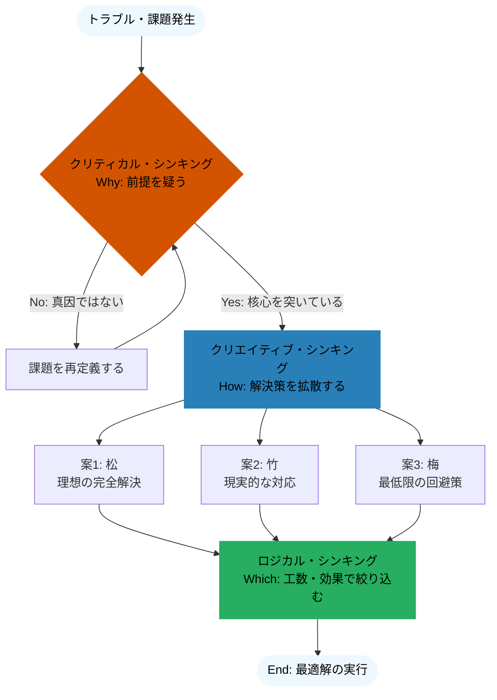

# 思考法（思考力）の紹介です

こんにちは！  

learning-navigator から「［若手向け］思考力の全体像」の講座案内が来ていたのを見て、

むかーし先輩に言われた事を思い出したので記事にしてみました。

興味を持っていただければ幸いです。

## なぜ技術力だけではなく、思考力も必要なのか？

仕事をしていてこんな困りごとに遭遇したことはありませんか？

* 「最新技術で実装したのに、『これ、顧客の要望と違くない？』と言われてしまった（要件定義のズレ）」

* 「トラブル対応で行き当たりばったりの修正をしてしまい、別のバグを生んでしまった（対症療法）」

* 「新しい機能のアイディアを出したいのに、既存の仕様に囚われて何も思いつかない（発想の枯渇）」

これらは技術力不足というよりも、**「思考のプロセス」** に不足がある状態で起きがちです。

わかりやすく例えるなら、「技術力」がアプリケーションだとすれば、それを適切に動かすための **「思考力」はOS（オペレーティングシステム）** です。

どれだけ高性能なアプリ（最新技術）を入れても、土台となるOS（思考力）が古いままでは、動作が重かったり、予期せぬエラーが起きたりしてしまいます。

技術のキャッチアップと並行してこのOSをアップデートすることで、学習効率が上がり、手戻りを減らし、仕事のパフォーマンスを劇的に向上させることができるのです。

この記事では、エンジニアが技術と共に鍛えるべき「3つの思考力」と、思考停止に陥らないための「数のマジック」をご紹介します。

## エンジニアが意識すべき「3つの思考力」

仕事を円滑に進めるためには、実は1つの思考法だけでは足りません。主に以下の3つを状況に応じて使い分ける必要があります。

### 1. ロジカル・シンキング（論理的思考）  
**「筋道を立てて考える力」** です。  
エンジニアには馴染み深いですが、「AだからB、BだからC」と因果関係を整理する力です。

* 活用シーン: バグの原因調査、複雑な仕様の分解。

### 2. クリティカル・シンキング（批判的思考）  
**「前提を疑い、本質を見極める力」** です。  
批判＝文句を言うことではありません。  
「本当にこの仕様でいいのか？」「そもそも解決すべき課題はそこなのか？」と、自問自答する力です。

* 活用シーン: 要件定義、コードレビュー、リファクタリングの判断。

### 3. クリエイティブ・シンキング（創造的思考）  
**「枠にとらわれず、新しい発想を生む力」** です。  
論理の積み上げだけでは到達できない、飛躍的な解決策を見つける力です。

* 活用シーン: 新規サービスの企画、ハック的な回避策の考案、UI/UXデザイン。

## 例えばこんなシーンで

課題解決の案出しの時に大体３つぐらいの案を出す感じになるかと思います。

なんで３つなのかといいますと、「相対的な比較」ができる最小の値だからと言われています。

２つだと、「やるか、やらないか」や「AかBか」という選択的な思考になりがちですが、

３つだと、柔軟にメリット・デメリットを比較するようになり、現実的な落とし所（妥協点ではない最適解）が見つけやすくなるとのこと。

アイデア出しやビジネスの意思決定においては、**「選択肢は3つ用意せよ」** というのが定石です。

例えば下記のような視点で３つ考える際に、先ほどの思考法を利用してみてください。

🌲 松（Premium）：  
　　リソース度外視。  
　　理想的な機能・品質を詰め込んだ「最高スペック版」。  
　　👉 クリエイティブ全開で、技術的な夢を語る案。 

🎍 竹（Standard）：  
　　納期と品質のバランスが取れた「現実的な最適解」。  
　　👉 ロジカルに実現可能性を担保した案。

🌸 梅（Light）：  
　　とにかく動けばOK。  
　　最小限の工数で済む「泥臭い回避策」。  
　　 👉 クリティカルに不要な要件を削ぎ落とした案。

---

上記の「松・竹・梅」を含め、問題にぶつかった際に脳内でどのような手順で思考を巡らせればよいか、フローチャートにまとめました。

「なんか、アイデア出てこないな」と思ったら、この図を思い出して **「今どのフェーズで止まっているか」「松竹梅は出揃ったか」** を確認してみてください。

 クリティカル（Why）で止まっているのか、クリエイティブ（How）が出ないのか、ロジカル（Which）に選べないのか、原因がわかれば対処できると思います。

## 最後に

今回は思考法について紹介しました。

興味を惹かれましたら、会社のeラーニングシステム（LEARNING NAVIGATOR）を活用して受講してみてください。

最初はこちらから：［若手向け］思考力の全体像

研修予約に関しては、事前に所属長に確認をとってください。
