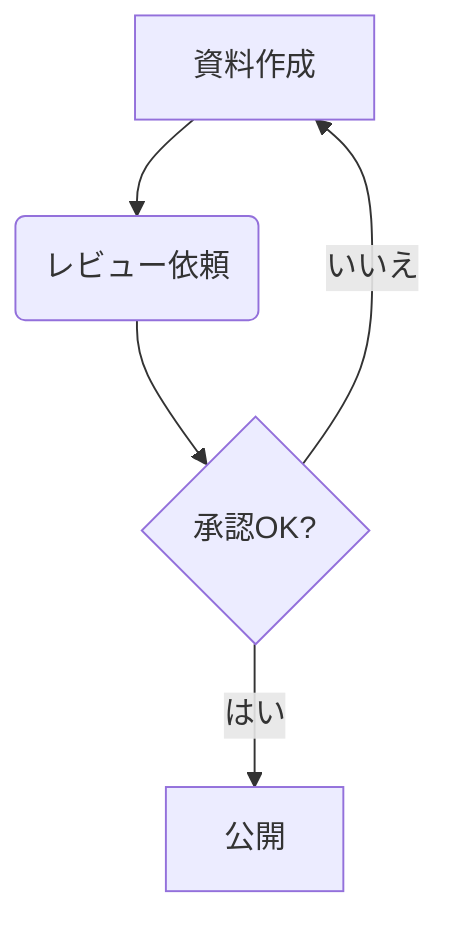
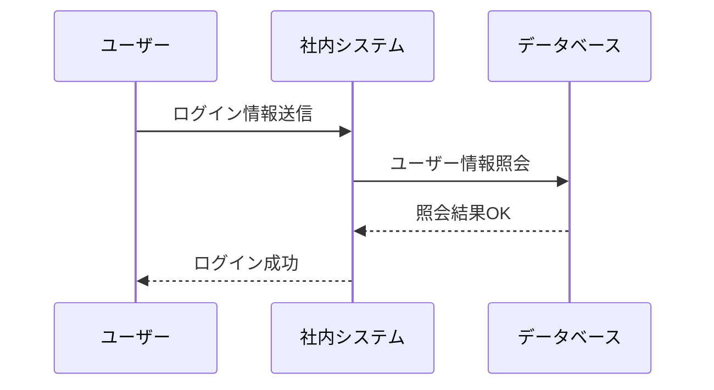
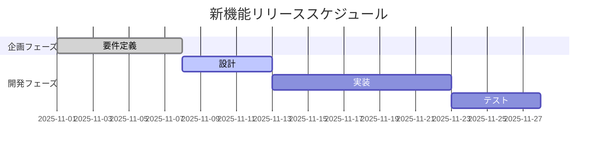

# ✍️ テキストで図が描ける！「Mermaid記法」入門
業務でフローチャートやシステムの構成図を作成する際、「PowerPointや作図ツールを起動するのが少し面倒...」「後から修正するのが大変...」と感じたことはありませんか？

この記事では、テキスト（文字）だけで簡単に、きれいな図を描くことができる「Mermaid（マーメイド）記法」を紹介します。

この記事を読むことで、企画書や設計書の作成効率が上がり、ドキュメントの「検索性」や「メンテナンス性」が格段に向上するヒントが得られます。

---

## 1. Mermaidとは？ (WHAT)
Mermaidは、特定の書き方（記法：きほう と読みます）に従ってテキストを書くだけで、自動的に図（ダイアグラム）を生成してくれるツールです。

例えば、皆さんが普段使っている社内Wikiや、多くのWebサービス（GitHubなど）でもサポートされており、特別なソフトをインストールせずに使えることが多いのが特徴です。

### なぜMermaidを使うの？ (WHY)

#### 修正が速い！
図形をマウスでドラッグする代わりに、テキストを数文字書き換えるだけです。👍

#### 検索できる！
図の中身もすべてテキストなので、Wiki内検索などで「あの図の、あの項目どこだっけ？」がすぐに見つかります。👍

#### 管理が楽！
Gitなどのバージョン管理システムで「どこが変更されたか」の差分（diff）が明確に分かります。👍

😱 GitにExcelとか反対！

---

## 2. まずは試してみよう (HOW)
Mermaidは、```mermaid と書かれたコードブロックの中に、決められたルールでテキストを記述します。

ここでは、代表的な3種類の図の描き方を見ていきましょう。

### ① フローチャート（流れ図）
業務の流れや、システムの処理手順を示すのに便利な図です。

フローチャートとは？ 物事のプロセス（流れ）を、箱（ノード）と矢印（エッジ）を使って視覚的に表現する図のことです。

▼ 書き方 (コピー＆ペーストして試せます)
````code

````
* graph TD; は「上から下へ(Top Down)」描画するという意味です。
* A[ ] や B( ) で図形の形を変えられます。
* --> で矢印をつなぎます。|はい| のように文字も追加できます。

😄 これは書きやすい

▼ 表示結果 （上記テキストをMermaid対応エディタに貼り付けると、以下のような図が表示されます）


### ② シーケンス図（順序図）
システム間や、部署間の「やり取りの順番」を時系列で示すのに最適です。

シーケンス図とは？ 複数の登場人物（モノやシステム）が、どのような順番でメッセージ（指示やデータ）を送り合っているかを示す図です。

▼ 書き方
````code

````
* participant で登場人物を定義します。as で表示名を変えられます。
* ->> は実線の矢印（メッセージ）、-->> は点線の矢印（応答）を意味します。

😄 これは書きやすい

▼ 表示結果


### ③ ガントチャート（スケジュール図）
プロジェクトのスケジュール管理や、タスクの進捗状況を示すのに使えます。

ガントチャートとは？ プロジェクト管理で使われる表の一種で、タスクのスケジュール（開始日、終了日）を横棒グラフで視覚的に示したものです。

▼ 書き方
````code

````
* done（完了）、active（作業中）、未指定（未着手）などでタスクの状態を示せます。
* after task2 のように、前のタスクが終わった後で開始、という指定も可能です。

😅 正直ガントはこれじゃ無い方が。。。

▼ 表示結果


---
## 3. まとめ (NEXT STEP)
Mermaid記法を使えば、テキストだけで、素早く、管理しやすい図を作成できることがお分かりいただけたでしょうか？

今回は3種類のみの紹介でしたが、Mermaidは他にも円グラフ、クラス図、状態遷移図など、多くの図に対応しています。

### 🔎 次に試してみましょう

この記事のサンプルコードをコピーして、皆さんがお使いのツールに貼り付けてみてください。

VSCodeであれば、[こちら](https://qiita.com/sato_kana/items/2a13f19017576488f017) を参考にして、拡張機能「Markdown Preview Mermaid Support」を入れて、*.md ファイルを作成してみてください。

### 公式ドキュメントを見てみる

もっと色々な図形や書き方を知りたくなったら、Mermaidの公式サイトにアクセスしてみてください。ブラウザ上で試せる「Live Editor」があり、とても便利です。

[Mermaid 公式サイト (Live Editor)](https://mermaid.live/)

図の作成・修正がスピードアップすれば、その分、本質的な業務にもっと時間を使えるようになります。ぜひ、今日からMermaidを活用してみてください！

### 参考リンク
* [Mermaid記法](https://notepm.jp/help/mermaid)
* [Markdown記法](https://notepm.jp/help/how-to-markdown)
