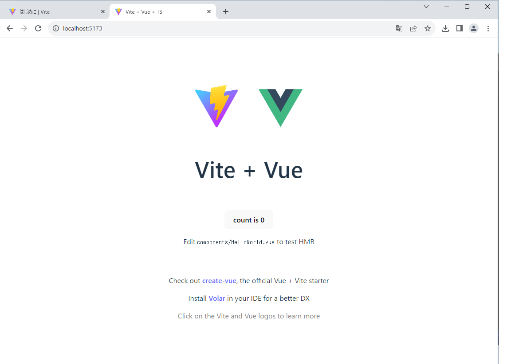

# 環境構築

## Vite（ヴィート）とは
Vite（ヴィート）は、Web開発をとにかく「速く」「快適に」してくれるための道具（ビルドツール）です。  
フランス語で「速い」という意味の言葉で、その名の通り、特に開発中のスピードが驚くほど速いのが最大の特徴です。  
Vue.jsの作者であるEvan You氏が開発したこともあり、Vue.jsとの相性は抜群です。  

### なにがすごいの
| すごいところ！                | ふつうの道具だと…                                | Viteだと、こうなる！ (うれしいこと)                               |
| :---------------------- | :----------------------------------------------- | :---------------------------------------------------------------- |
| **🚀 準備がロケットスタート！** | ゲームを始めるとき、ながーいロード時間があった…  | **すぐに作り始められる！** 「はじめ！」って思ったらもう始まってる！        |
| **⚡️ 直したら、すぐ変わる！** | お絵かきで色を変えたら、乾くまで待たないとダメ… | **魔法みたいにパッと変わる！** 直したしゅんかんに画面が変わるから、どんどん試せる！ |
| **✨ むずかしいおまじないが不要！** | 新しいおもちゃで遊ぶのに、ぶ厚い説明書を読まないと… | **すぐに遊べる！** かんたんな準備だけで、すぐにプログラム作りを始められるよ！ |
| **💪 公開するときにパワーアップ！** | みんなに作品を見せるとき、そのままだと重くて大変…   | **ファイルを軽くしてくれる！** みんなが見やすいように、賢く変身させてくれる！   |

## Node.js インストール
1. 下記サイトからダウンロードしてインストールしてください。  
   [https://nodejs.org/ja](https://nodejs.org/ja)　＊18系を推奨

1. 確認  
   バージョン表示が行えればインストール成功です。
   ```bash
   $ node -v
   v18.17.0
   ```

## Viteを使ってプロジェクトを作成

1. 「app」プロジェクトを作成してみましょう。
   ```bash
   $ npm create vite@latest -y
   ```
   ```bash
   # 実行結果
   $ npm create vite@latest -y
   Project name: ... app
   Select a framework: » Vue
   Select a variant: » TypeScript
   
   Scaffolding project in C:\Users\Vbox11\app...
   Done. Now run:

   cd app
   npm install
   npm run dev
   ```
2. 作成した「app」プロジェクトを確認する
   ```bash
   # ディレクトリ移動
   $ cd app

   # パッケージ管理ファイル作成
   $ npm install
   added 42 packages, and audited 43 packages in 24s
   4 packages are looking for funding
   run `npm fund` for details

   found 0 vulnerabilities

   # 開発用サーバ起動
   $ npm run dev
   > app@0.0.0 dev
   > vite
   
   VITE v4.4.8  ready in 1418 ms

   ➜  Local:   http://localhost:5173/
   ➜  Network: use --host to expose
   ➜  press h to show help
   ```
   上記の「Local:」をブラウザで開くと表示できます。
   

## ブラウザに拡張機能を追加
1. Vue.jsの開発で便利な拡張機能を追加します。  
   [Vue.js devtools](https://chrome.google.com/webstore/detail/vuejs-devtools/nhdogjmejiglipccpnnnanhbledajbpd?hl=ja)

1. 拡張機能の「ファイルの URL へのアクセスを許可する」をONにします。
   

1. デベロッパーツールに「vue」が追加されます
   
   データやComponentの状態や構造を見ることができるようになります。
