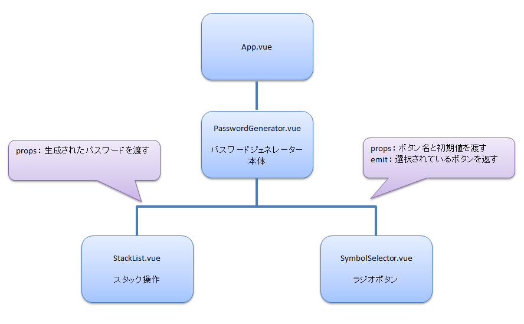

# コンポーネントの構成について

## コンポーネントってなに？
まずは小さな部品を作ることから始め、それらを組み合わせて大きなページを作っていく。  
この「コンポーネント思考」に慣れることが、Vueをマスターするための第一歩です。
* コンポーネントは再利用可能なUI部品であり、Vue開発の中心的な考え方です。
* 「再利用性」「保守性」「可読性」が向上し、効率的な開発が可能になります。
* コンポーネントは親子関係を持ち、Propsで親から子へデータを渡し、Emitで子から親へイベントを伝えます。

## メリットは
| メリット                      | たとえるなら…                                                                 | だから、うれしい！                                                              |
| :-------------------------- | :---------------------------------------------------------------------------- | :------------------------------------------------------------------------------ |
| **🤖 なんかいも使える！** | **お気に入りのレゴブロック**みたいなもの。 同じ形のブロックは、お城にもロケットにも使えるよね。 | 一回作った「ボタン」とかの部品を、色々なページで**はんこみたいにペタペタ使える**から、めっちゃ楽ちん！ |
| **🎨 直すのがカンタン！** | **せいとんされたおもちゃ箱**みたい。 「ミニカーの箱」「ぬいぐるみの箱」って分かれてると、探しやすいよね。 | 「ボタンのデザインを変えたい！」って思ったら、**ボタンの部品だけ直せばOK！** ぜんぶのページを見なくていいから、すぐ終わる！ |
| **📚 見た目がスッキリ！** | **本が「しょう」や「だんらく」に分かれている**のと同じ。 ながーいお話も、分かれているから読みやすい。 | プログラムが部品ごとに分かれているから、**どこに何が書いてあるか一目でわかる！** 迷子にならず、スイスイ読めるよ！ |

## 今回の構成
下記の様にコンポーネントを分割しています。  
また、データのやり取りには、props と emit を使っています。

